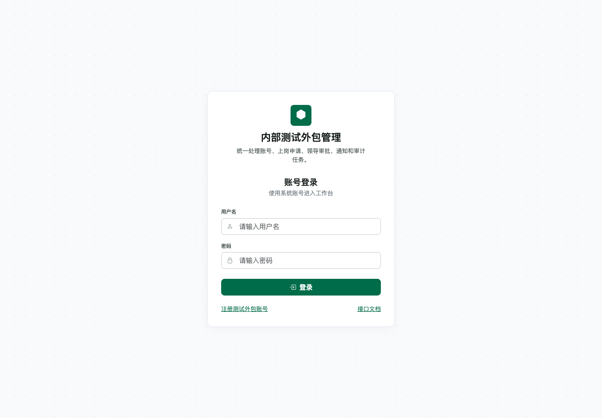
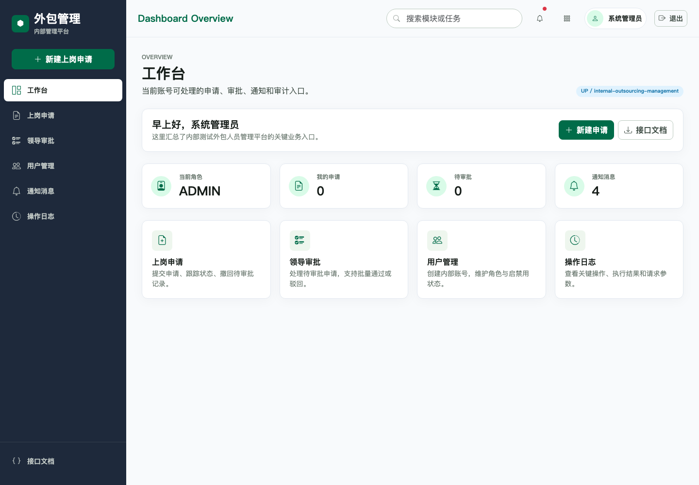
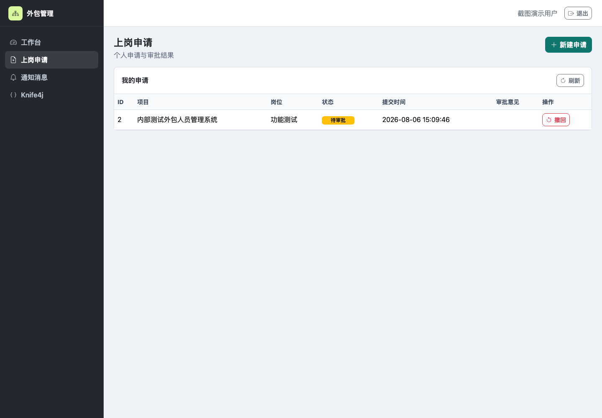
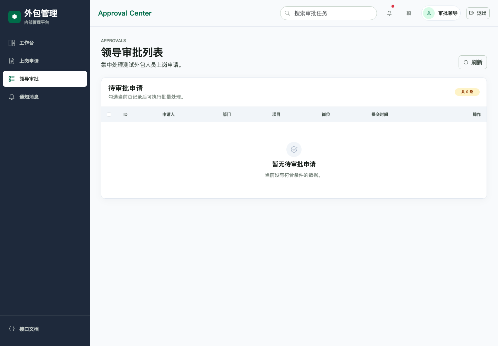
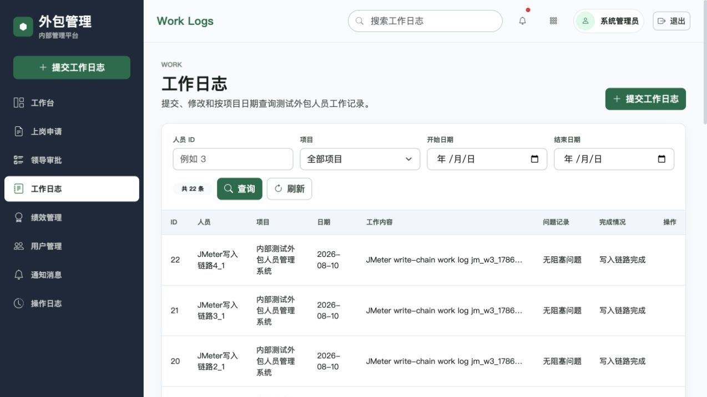
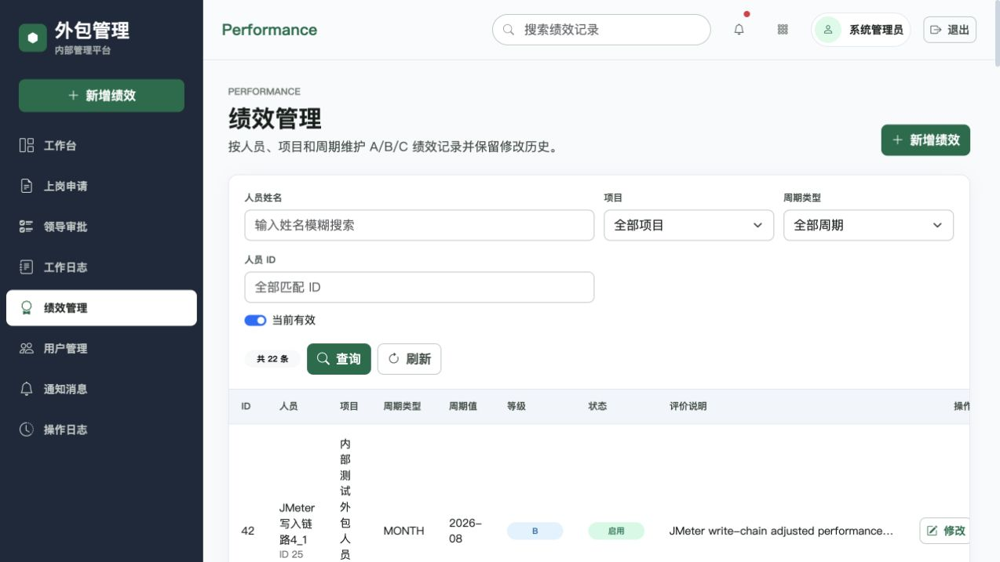
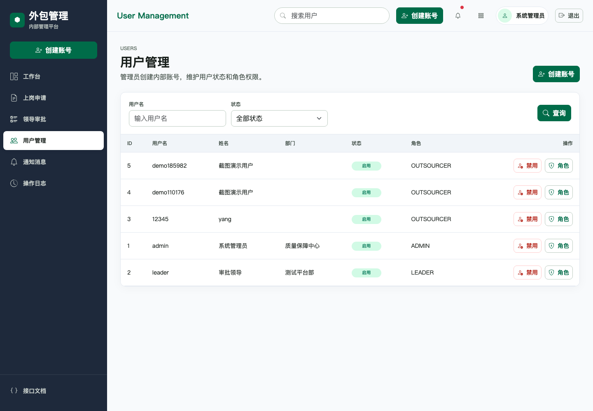
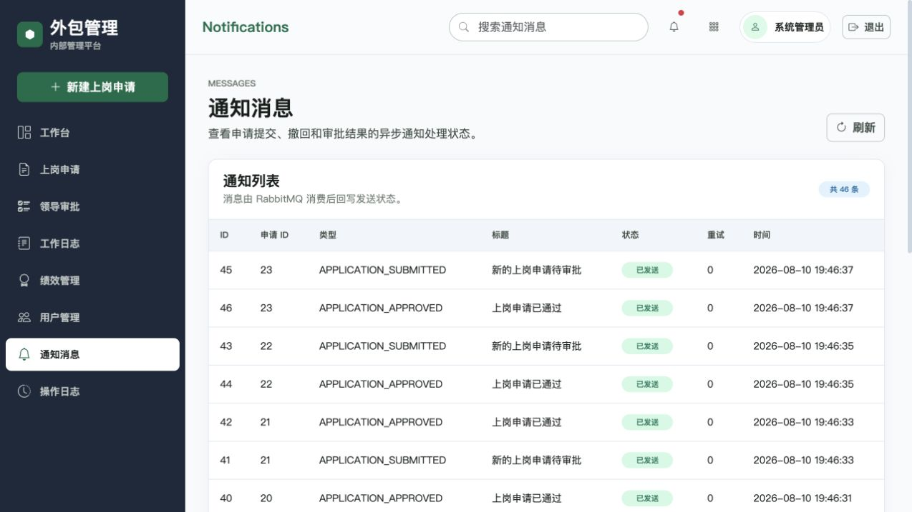
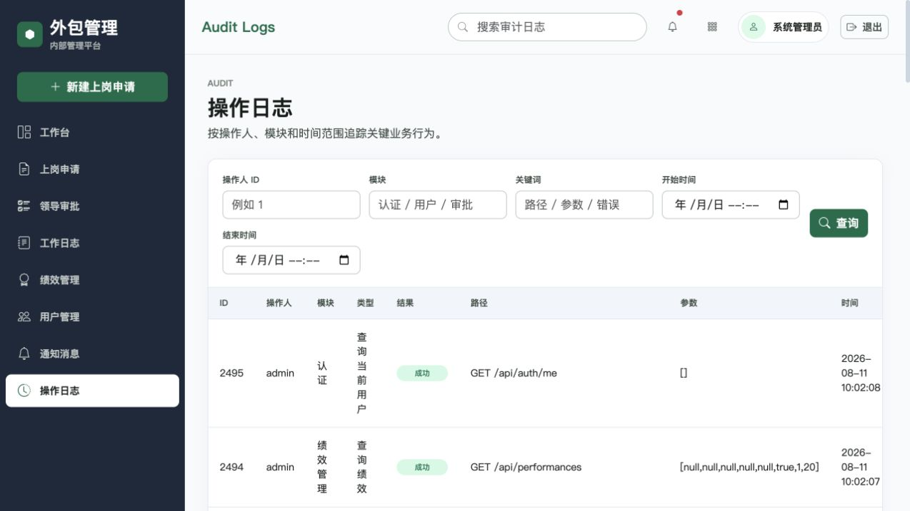

# 内部测试外包人员管理系统 / Internal Outsourcing Management System

这是一个面向企业内部测试外包人员的后台管理系统。

This is a backend management system for internal outsourced testing personnel.

系统围绕测试外包人员的入场、审批、工作日志、绩效、通知和审计流程展开，提供账号认证、RBAC 权限、用户管理、上岗申请、领导审批、RabbitMQ 通知、MySQL 权威审计存储、Elasticsearch 候选检索增强、Prometheus/Grafana 监控和接口文档能力。后端工程位于仓库根目录，设计资料和实现文档统一归档在 `docs/`。

## 功能模块 / Features

| 模块 | 能力 |
| --- | --- |
| 用户认证 | 注册、登录、退出、JWT Token、Redis 登录态、密码加密 |
| RBAC 权限 | 用户、角色、权限、角色分配、接口访问控制 |
| 用户管理 | 管理员创建内部账号、启用/禁用用户、分配角色 |
| 上岗申请 | 测试外包人员提交申请、查看个人申请、撤回待审批申请 |
| 领导审批 | 待审批分页查询、通过、驳回、批量审批 |
| 工作日志 | 外包人员提交/修改个人日志，领导和管理员按人员、项目、日期查询 |
| 绩效管理 | A/B/C 绩效评定、月度/季度/项目周期、修改原因和历史版本 |
| 通知消息 | 申请提交、撤回、审批结果通过 RabbitMQ 异步通知并落库 |
| 操作审计 | `@OperationLog` + AOP 自动记录关键操作，敏感字段脱敏；关键词检索优先用 Elasticsearch 获取候选 ID，再由 MySQL 做外层过滤、兜底匹配、排序和分页 |
| 监控部署 | Actuator、Prometheus、Grafana、Dockerfile、Docker Compose、CI/CD 模拟 |
| 接口文档 | Swagger UI / Knife4j 输出接口说明 |

## 项目截图 / Screenshots

| 登录页 | 工作台 |
| --- | --- |
|  |  |

| 上岗申请 | 领导审批 |
| --- | --- |
|  |  |

| 工作日志 | 绩效管理 |
| --- | --- |
|  |  |

| 用户管理 | 通知消息 |
| --- | --- |
|  |  |

| 操作日志 |
| --- |
|  |

## 技术栈 / Tech Stack

- Backend: Java 21, Spring Boot 3.x, Maven, Lombok
- Persistence: MyBatis-Plus, MySQL 8.x
- Cache and session: Redis
- Messaging: RabbitMQ
- Search: Elasticsearch 8.x audit candidate search, MySQL authoritative audit fallback and pagination
- Monitoring: Spring Boot Actuator, Micrometer, Prometheus, Grafana
- Security: Spring Security, JWT, BCrypt, RBAC
- Frontend: Thymeleaf, Bootstrap 5, Bootstrap Icons
- API docs: Swagger UI, Knife4j, OpenAPI
- Quality: JUnit, Mockito, Checkstyle, JaCoCo, SLF4J

## 快速启动 / Quick Start

一键启动 MySQL、Redis、RabbitMQ、Elasticsearch、Prometheus、Grafana 和应用容器：

```bash
docker compose up -d --build
```

如果使用本地 Maven 启动应用，只启动依赖服务：

```bash
docker compose up -d mysql redis rabbitmq elasticsearch
./mvnw spring-boot:run
```

运行测试与代码规范检查：

```bash
./mvnw clean test
./mvnw checkstyle:check
./mvnw verify
```

常用入口：

| 地址 | 说明 |
| --- | --- |
| `http://localhost:8080/ui/login` | 后台登录页 |
| `http://localhost:8080/ui/register` | 测试外包人员注册页 |
| `http://localhost:8080/ui/dashboard` | 工作台 |
| `http://localhost:8080/ui/work-logs` | 工作日志 |
| `http://localhost:8080/ui/performances` | 绩效管理 |
| `http://localhost:8080/doc.html` | Knife4j 接口文档 |
| `http://localhost:8080/swagger-ui.html` | Swagger UI |
| `http://localhost:8080/actuator/prometheus` | Prometheus 指标 |
| `http://localhost:3001` | Grafana 看板 |

默认账号：

| 账号 | 密码 | 角色 |
| --- | --- | --- |
| `admin` | `Admin@123456` | 系统管理员 |
| `leader` | `Leader@123456` | 上级领导 |

## 项目文档 / Documentation

| 文档 | 说明 |
| --- | --- |
| [设计资料索引](docs/design/README.md) | 需求、PRD、ER 图、UML 图和系统架构图 |
| [PRD](docs/design/PRD.md) | 项目背景、用户故事、验收标准、范围边界和风险 |
| [需求文档](docs/design/%E9%9C%80%E6%B1%82%E6%96%87%E6%A1%A3.md) | 业务流程和功能需求拆分 |
| [系统架构图](docs/design/%E7%B3%BB%E7%BB%9F%E6%9E%B6%E6%9E%84.png) | 分层架构、认证授权、服务、数据访问和扩展组件 |
| [ER 图](docs/design/ER.png) | 核心实体、属性和关系 |
| [UML 类图](docs/design/UML.png) | 实体类、关联关系、分层落地结构和关键枚举 |
| [实现说明](docs/implementation/README.md) | 后端交付范围、启动步骤、默认账号和目录说明 |
| [前端产品需求文档](docs/design/frontend-prd.md) | 目标用户、核心场景、页面结构、视觉风格和交互状态要求 |
| [接口说明](docs/implementation/api.md) | REST API、权限、请求示例和页面入口 |
| [数据库设计](docs/implementation/database.md) | 表结构、关系、索引和初始化数据 |
| [部署与监控说明](docs/implementation/deployment-monitoring.md) | Docker、Elasticsearch、Prometheus/Grafana、JMeter 和 CI/CD |
| [项目最终交付报告](docs/implementation/week4-final-delivery-report.md) | 项目范围、模块拆分、功能交付、测试压测、部署监控和复盘总结 |
| [测试记录](docs/implementation/test-record.md) | 单元测试、页面验证、接口 smoke test 和人工联调记录 |
| [问题清单](docs/implementation/problem-list.md) | 项目推进过程中的问题、处理方式和结论 |

## 测试与质量 / Testing

已验证内容：

- `./mvnw clean verify`: 88 个测试通过，JaCoCo 全项目生产代码行覆盖率 89.46%，超过 Week4 80% 门控。
- `./mvnw checkstyle:check`: 0 个 Checkstyle violations。
- `node --check src/main/resources/static/js/app.js`: 前端脚本语法通过。
- `xmllint --noout docs/implementation/jmeter-login-concurrency.jmx docs/implementation/jmeter-week3-core-business.jmx docs/implementation/jmeter-week3-write-chain.jmx`: JMeter 模板 XML 结构通过。
- `docker compose config -q`: Compose 配置语法通过。
- `docker compose up -d --build`: 应用镜像重建并启动到 healthy，`/api/health`、`/actuator/health/readiness`、`/doc.html`、核心 UI 页面和 `/actuator/prometheus` smoke test 通过。
- `scripts/run-week3-jmeter.sh`: 登录并发、核心读链路、写入链路三组压测均 0 errors，最新结果见项目最终交付报告。
- 前端截图基于本地真实 Spring Boot 页面生成，覆盖登录、工作台、上岗申请、领导审批、工作日志、绩效管理、用户管理、通知消息和操作日志。

## 目录结构 / Structure

```text
.
├── src/                     # Spring Boot 源码、页面、静态资源、测试
├── config/                  # Checkstyle 配置
├── docs/
│   ├── design/              # PRD、需求文档、架构图、ER 图、UML 图、draw.io 源文件
│   ├── implementation/      # API、数据库、部署监控、测试记录、问题清单、压测模板
│   └── screenshots/         # 登录、工作台、上岗申请、领导审批、工作日志、绩效、通知和操作日志截图
├── ops/                     # Prometheus 和 Grafana 配置
├── scripts/                 # JMeter 自动化脚本
├── docker-compose.yml       # MySQL、Redis、RabbitMQ、ES、监控和应用容器
├── Dockerfile               # Spring Boot 应用镜像
├── pom.xml                  # Maven 项目配置
├── mvnw / mvnw.cmd
└── README.md
```

## License

No open-source license has been added yet.
