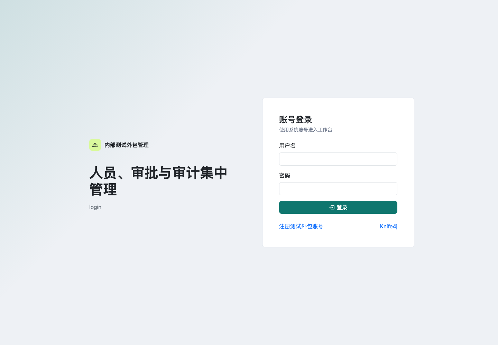
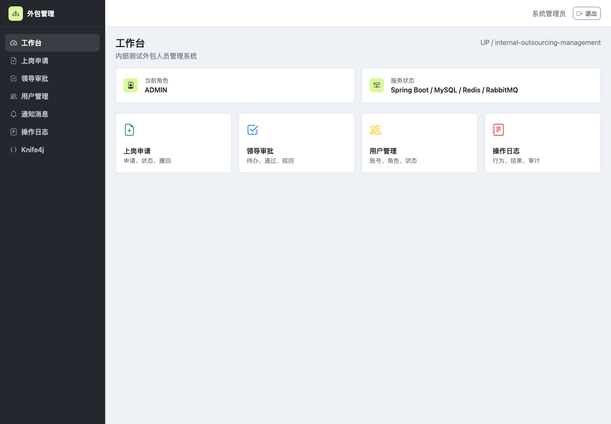
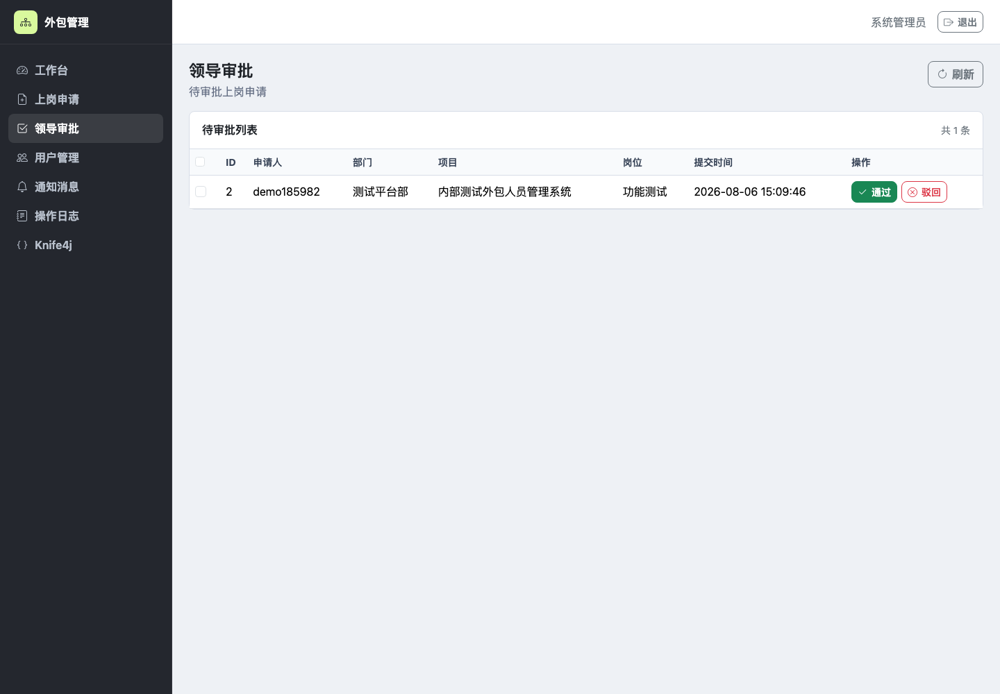
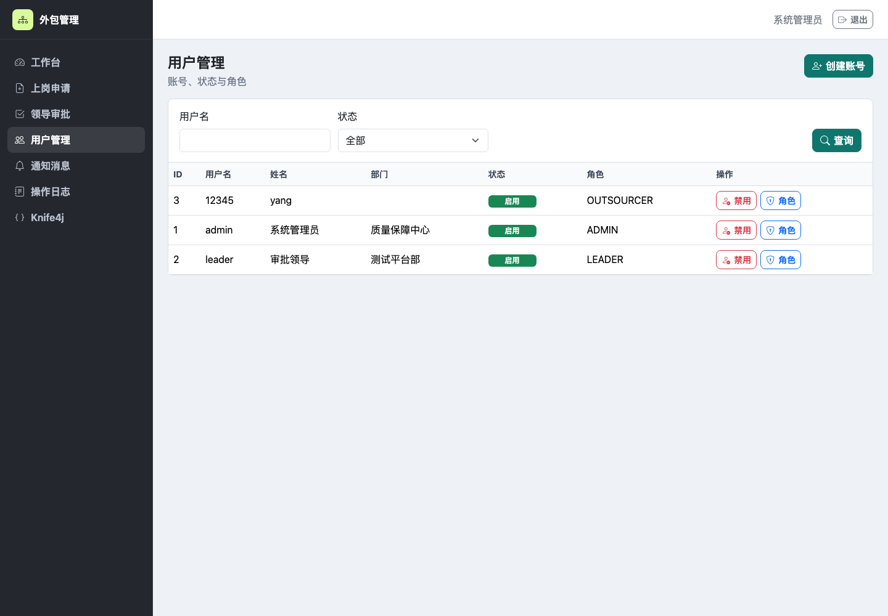

# 内部测试外包人员管理系统 / Internal Outsourcing Management System

这是一个面向企业内部测试外包人员的后台管理系统。

This is a backend management system for internal outsourced testing personnel.

系统围绕测试外包人员的入场、审批、通知和审计流程展开，提供账号认证、RBAC 权限、用户管理、上岗申请、领导审批、RabbitMQ 通知、操作日志和接口文档能力。当前实现位于 `week2/`，需求与设计资料保留在 `week1/`。

## 功能模块 / Features

| 模块 | 能力 |
| --- | --- |
| 用户认证 | 注册、登录、退出、JWT Token、Redis 登录态、密码加密 |
| RBAC 权限 | 用户、角色、权限、角色分配、接口访问控制 |
| 用户管理 | 管理员创建内部账号、启用/禁用用户、分配角色 |
| 上岗申请 | 测试外包人员提交申请、查看个人申请、撤回待审批申请 |
| 领导审批 | 待审批分页查询、通过、驳回、批量审批 |
| 通知消息 | 申请提交、撤回、审批结果通过 RabbitMQ 异步通知并落库 |
| 操作审计 | `@OperationLog` + AOP 自动记录关键操作，敏感字段脱敏 |
| 接口文档 | Swagger UI / Knife4j 输出接口说明 |

## 项目截图 / Screenshots

| 登录页 | 工作台 |
| --- | --- |
|  |  |

| 上岗申请 | 领导审批 |
| --- | --- |
|  |  |

| 用户管理 |
| --- |
|  |

## 技术栈 / Tech Stack

- Backend: Java 21, Spring Boot 3.x, Maven, Lombok
- Persistence: MyBatis-Plus, MySQL 8.x
- Cache and session: Redis
- Messaging: RabbitMQ
- Security: Spring Security, JWT, BCrypt, RBAC
- Frontend: Thymeleaf, Bootstrap 5, Bootstrap Icons
- API docs: Swagger UI, Knife4j, OpenAPI
- Quality: JUnit, Mockito, Checkstyle, SLF4J

## 快速启动 / Quick Start

进入后端工程目录：

```bash
cd week2
```

启动 MySQL、Redis 和 RabbitMQ：

```bash
docker compose up -d
```

运行测试与代码规范检查：

```bash
./mvnw clean test
./mvnw checkstyle:check
```

启动应用：

```bash
./mvnw spring-boot:run
```

常用入口：

| 地址 | 说明 |
| --- | --- |
| `http://localhost:8080/ui/login` | 后台登录页 |
| `http://localhost:8080/ui/register` | 测试外包人员注册页 |
| `http://localhost:8080/ui/dashboard` | 工作台 |
| `http://localhost:8080/doc.html` | Knife4j 接口文档 |
| `http://localhost:8080/swagger-ui.html` | Swagger UI |

默认账号：

| 账号 | 密码 | 角色 |
| --- | --- | --- |
| `admin` | `Admin@123456` | 系统管理员 |
| `leader` | `Leader@123456` | 上级领导 |

## 项目文档 / Documentation

| 文档 | 说明 |
| --- | --- |
| [PRD](week1/PRD.md) | 项目背景、用户故事、验收标准、范围边界和风险 |
| [需求文档](week1/%E9%9C%80%E6%B1%82%E6%96%87%E6%A1%A3.md) | 业务流程和功能需求拆分 |
| [系统架构图](week1/%E7%B3%BB%E7%BB%9F%E6%9E%B6%E6%9E%84.png) | 分层架构、认证授权、服务、数据访问和扩展组件 |
| [ER 图](week1/ER.png) | 核心实体、属性和关系 |
| [UML 类图](week1/UML.png) | 实体类、关联关系、分层落地结构和关键枚举 |
| [实现说明](week2/docs/README.md) | 后端交付范围、启动步骤、默认账号和目录说明 |
| [接口说明](week2/docs/api.md) | REST API、权限、请求示例和页面入口 |
| [数据库设计](week2/docs/database.md) | 表结构、关系、索引和初始化数据 |
| [测试记录](week2/docs/test-record.md) | 单元测试、页面验证、接口 smoke test 和人工联调记录 |
| [问题清单](week2/docs/problem-list.md) | 项目推进过程中的问题、处理方式和结论 |

## 测试与质量 / Testing

已验证内容：

- `./mvnw clean test`: 17 个测试通过，覆盖 JWT、注册登录、用户管理、RBAC、审批、基础资料和通知消息。
- `./mvnw checkstyle:check`: 0 个 Checkstyle violations。
- `docker compose up -d` 后启动应用，`/api/health`、`/ui/login`、`/doc.html` 可访问。
- 前端截图基于本地真实 Spring Boot 页面生成，覆盖登录、工作台、上岗申请、领导审批和用户管理。

## 目录结构 / Repository Structure

```text
.
├── week1/                  # 需求、PRD、系统架构图、ER 图、UML 类图
├── week2/                  # Spring Boot 后端实现
│   ├── src/main/java/      # Controller、Service、Mapper、Entity、Security、AOP
│   ├── src/main/resources/ # 配置、SQL、Thymeleaf 页面、静态资源
│   ├── src/test/java/      # 单元测试
│   ├── docs/               # API、数据库、测试记录、截图、问题清单
│   ├── docker-compose.yml  # MySQL、Redis、RabbitMQ
│   └── pom.xml             # Maven 项目配置
└── README.md
```

## License

No open-source license has been added yet.
