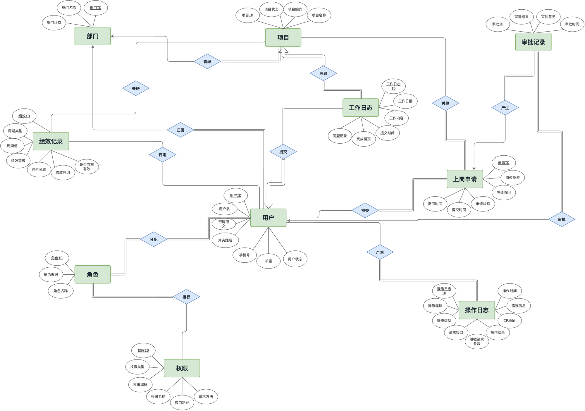

# 内部测试外包人员管理系统 / Internal Outsourcing Management System

这是一个面向企业内部测试外包人员的后台管理系统。

This is a backend management system for internal outsourced testing personnel.

## 项目概览 / Project Overview

系统围绕测试外包人员的入场、审批、日志、绩效和审计流程展开，核心用户包括测试外包人员、上级领导和系统管理员。当前仓库先公开第一周的需求分析与技术设计成果，后续会按周补充后端工程代码、接口文档、数据库脚本、测试记录和项目复盘。

The system focuses on onboarding, approval, work logs, performance review, and audit tracking. The first public version contains Week 1 requirements and design deliverables. Future updates will add backend code, API documentation, database scripts, testing records, and project summaries.

## 当前进度 / Current Status

| 周次 / Week | 阶段 / Phase | 状态 / Status | 重点 / Focus |
| --- | --- | --- | --- |
| Week 1 | 需求分析与技术设计 / Requirements and design | 已完成初版 / Initial version completed | PRD、需求文档、系统架构图、ER 图、UML 类图 |
| Week 2 | 框架搭建与核心功能 / Backend foundation | 计划中 / Planned | Spring Boot、MyBatis-Plus、MySQL、Redis、JWT/RBAC |
| Week 3 | 高级功能与性能优化 / Advanced features | 计划中 / Planned | 审批、操作日志、绩效、MQ/ES/监控等可选扩展 |
| Week 4 | 测试与交付总结 / Testing and delivery | 计划中 / Planned | 单测、接口联调、压测、部署文档、复盘总结 |

## 第一周成果 / Week 1 Deliverables

| 类型 / Type | 文件 / File | 说明 / Description |
| --- | --- | --- |
| PRD | [week1/PRD.md](week1/PRD.md) | 项目背景、用户故事、验收标准、范围边界和风险 |
| 需求文档 / Requirements | [week1/需求文档.md](week1/%E9%9C%80%E6%B1%82%E6%96%87%E6%A1%A3.md) | 原始需求整理和功能拆分 |
| 系统架构图 / Architecture | [week1/系统架构.png](week1/%E7%B3%BB%E7%BB%9F%E6%9E%B6%E6%9E%84.png) | 分层架构、认证授权、服务、数据访问、存储和扩展组件 |
| 系统架构图源文件 / Architecture source | [week1/system-architecture-relaxed.drawio](week1/system-architecture-relaxed.drawio) | 可编辑 draw.io 源文件 |
| ER 图 / ER Diagram | [week1/ER.png](week1/ER.png) | 核心实体、属性和关系 |
| ER 图源文件 / ER source | [week1/ER-uml-style.drawio](week1/ER-uml-style.drawio) | 可编辑 draw.io 源文件 |
| UML 类图 / UML Class Diagram | [week1/UML.png](week1/UML.png) | 实体类、关联关系、分层落地结构和关键枚举 |
| UML 类图源文件 / UML source | [week1/internal-outsourcing-uml-optimized.drawio](week1/internal-outsourcing-uml-optimized.drawio) | 可编辑 draw.io 源文件 |

## 设计预览 / Design Preview

### 系统架构 / System Architecture

### ER 模型 / ER Model

### UML 类设计 / UML Class Design

## 核心模块 / Core Modules

- 用户认证 / Authentication: 注册、登录、退出、JWT Token、密码加密。
- RBAC 权限 / Authorization: 用户、角色、权限、角色分配、接口访问控制。
- 上岗申请 / Onboarding Application: 提交申请、查询详情、撤回待审批申请。
- 领导审批 / Approval: 待审批列表、通过、驳回、审批意见和审批记录。
- 工作日志 / Work Logs: 日志提交、修改、按人员/项目/日期查询。
- 绩效管理 / Performance: A/B/C 绩效评定、修改原因、历史记录。
- 操作审计 / Operation Audit: 关键操作日志、敏感字段脱敏、异常追踪。

## 技术路线 / Technical Direction

- Backend: Java, Spring Boot 3.x, Maven, Lombok
- Persistence: MyBatis-Plus, MySQL 8.x
- Cache and session support: Redis
- Security: JWT, BCrypt, RBAC
- API docs: Swagger 3 / Knife4j
- Testing and quality: Postman, JUnit, Mockito, JMeter, Checkstyle
- Optional extensions: MQ, Elasticsearch, Prometheus, Grafana, Docker, Spring Cloud Alibaba

## License

No open-source license has been added yet.
