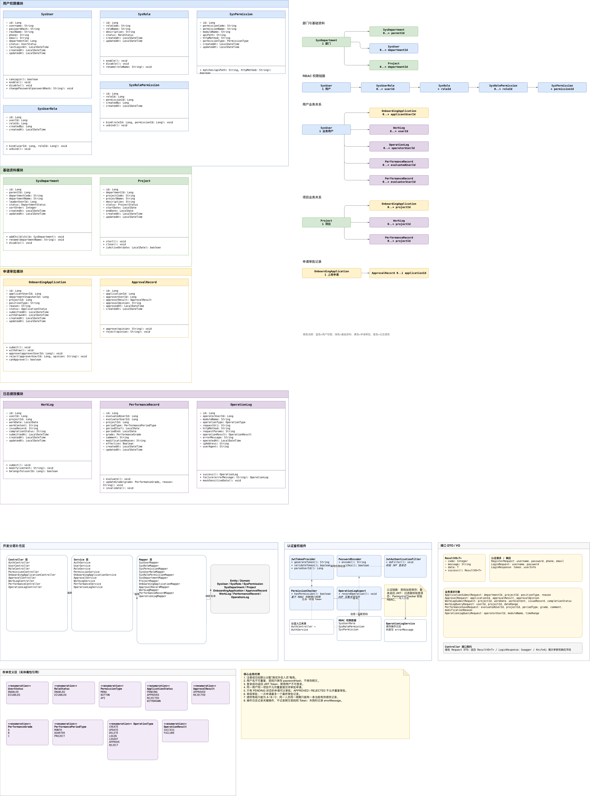

# Week 1: 需求分析与技术设计 / Requirements and Technical Design

本目录保存“内部测试外包人员管理系统”第一周正式成果，重点是把项目目标、业务范围、系统边界、数据模型和后端类设计整理清楚，为后续 Spring Boot 实现做准备。

This folder contains the official Week 1 deliverables for the internal outsourcing management system. The goal is to clarify product scope, business flows, architecture, data modeling, and backend class design before implementation.

## 交付物 / Deliverables

| 类型 / Type | 文件 / File | 用途 / Purpose |
| --- | --- | --- |
| PRD | [PRD.md](PRD.md) | 项目背景、用户画像、用户故事、验收标准、风险和待确认问题 |
| 需求文档 / Requirements | [需求文档.md](%E9%9C%80%E6%B1%82%E6%96%87%E6%A1%A3.md) | 原始需求整理、业务流程和功能需求拆分 |
| 系统架构图 / Architecture | [系统架构.png](%E7%B3%BB%E7%BB%9F%E6%9E%B6%E6%9E%84.png) | 展示前端、接口、认证授权、服务、数据访问、存储与扩展层 |
| 系统架构图源文件 / Architecture source | [system-architecture-relaxed.drawio](system-architecture-relaxed.drawio) | draw.io 可编辑版本 |
| ER 图 / ER Diagram | [ER.png](ER.png) | 展示用户、角色、权限、部门、项目、申请、审批、日志和绩效实体关系 |
| ER 图源文件 / ER source | [ER-uml-style.drawio](ER-uml-style.drawio) | draw.io 可编辑版本 |
| UML 类图 / UML Class Diagram | [UML.png](UML.png) | 展示实体类、关联关系、Controller/Service/Mapper 分层和关键 DTO/VO |
| UML 类图源文件 / UML source | [internal-outsourcing-uml-optimized.drawio](internal-outsourcing-uml-optimized.drawio) | draw.io 可编辑版本 |

## 建议阅读顺序 / Suggested Reading Order

1. [需求文档.md](%E9%9C%80%E6%B1%82%E6%96%87%E6%A1%A3.md): 先了解项目背景、角色和核心功能。
2. [PRD.md](PRD.md): 再查看产品目标、验收标准、范围边界和项目风险。
3. [系统架构.png](%E7%B3%BB%E7%BB%9F%E6%9E%B6%E6%9E%84.png): 理解后端分层、认证授权和数据访问链路。
4. [ER.png](ER.png): 理解核心业务实体和数据关系。
5. [UML.png](UML.png): 对照后续 Java 后端实现的类、接口、服务和枚举设计。

## 图片预览 / Diagram Preview

### 系统架构 / System Architecture

### ER 图 / ER Diagram

### UML 类图 / UML Class Diagram

## 待确认问题 / Open Questions

- 前端采用 Thymeleaf + Bootstrap 5，还是 Vue/React + JavaScript/HTML。
- MQ、Elasticsearch、Prometheus/Grafana、Docker、Spring Cloud Alibaba 是必做项还是加分扩展。
- 上岗审批流程是否确认只做单级审批。
- 绩效周期按月、季度、项目周期，还是自定义周期。
- 操作日志先落 MySQL/文件日志，还是必须接入 Elasticsearch。
